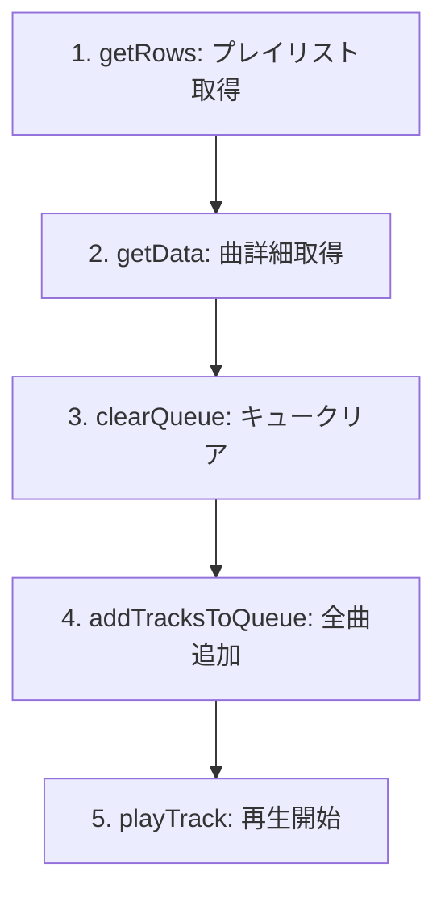

# KEF LSX II ネットワークスピーカー 外部コントロールAPI仕様書

## 目次

1. [概要](#概要)
3. [APIエンドポイント一覧](#apiエンドポイント一覧)
4. [データ型定義](#データ型定義)
5. [音楽再生API詳細](#音楽再生api詳細)
6. [設定管理API](#設定管理api)
7. [イベント通知システム](#イベント通知システム)
8. [エラーハンドリング](#エラーハンドリング)

## 概要

本文書は、KEF LSX II ネットワークスピーカーを外部プログラムから制御するためのHTTP/JSON API仕様を網羅的に解説します。

### 接続情報
- **プロトコル**: HTTP
- **ポート**: 80（デフォルト）
- **ベースURL**: `http://[SPEAKER_IP]/api`
- **コンテンツタイプ**: `application/json`
- **文字エンコーディング**: UTF-8

### 認証
現在のバージョンでは認証は不要です。スピーカーと同じネットワーク内からアクセス可能です。


## APIエンドポイント一覧

| エンドポイント | メソッド | 説明 | 必須パラメータ |
|--------------|---------|------|---------------|
| `/api/getRows` | GET | リスト情報（要約）の取得 | `path`, `roles`, `from`, `to` |
| `/api/getData` | GET | 詳細情報（完全）の取得 | `path`, `roles` |
| `/api/setData` | POST | 設定変更・コマンド実行 | `path`, `role`, `value` |
| `/api/getImage` | GET | アートワーク画像の取得 | `path` |
| `/api/event/modifyQueue` | POST | イベント購読の設定 | `subscribe` または `unsubscribe` |
| `/api/event/pollQueue` | GET | イベントのロングポーリング | `queueId`, `timeout` |

## データ型定義

### 基本データ型

#### 値オブジェクトの型指定
```json
{
  "type": "TYPE_NAME",
  "TYPE_NAME": VALUE,
  "stability": 0  // 多くの場合必須
}
```

| type値 | 実際のキー | 値の型 | 用途例 |
|--------|-----------|--------|--------|
| `i32_` | `i32_` | number (整数) | 音量、インデックス |
| `i64_` | `i64_` | number (長整数) | 再生時間（ミリ秒） |
| `i16_` | `i16_` | number (短整数) | 音量ステップ |
| `string_` | `string_` | string | 設定文字列 |
| `bool_` | `bool_` | boolean | ON/OFF設定 |
| `double_` | `double_` | number (浮動小数) | DSP設定値 |
| `playerPlayMode` | `playerPlayMode` | string | 再生モード |
| `kefStandbyMode` | `kefStandbyMode` | string | スタンバイ設定 |

### トラックオブジェクト

#### 要約情報（getRowsで取得）
```json
{
  "type": "audio",
  "path": "airable:https://.../track/[ID]",
  "title": "曲名",
  "subTitle": "アーティスト名",
  "icon": "画像パスまたはURL",
  "duration": 240000,
  "id": "unique_track_id"
}
```

#### 完全情報（getDataで取得）
```json
{
  "type": "audio",
  "path": "playlists:item/1",
  "title": "曲名",
  "value": {
    "type": "i32_",
    "i32_": 0,
    "stability": 0
  },
  "context": {
    "title": "Playlist",
    "type": "container",
    "containerType": "context",
    "path": "playlists:pl/trackcontextmenu?action=cmnode?itemid=1?plid=0?seqnum=0",
    "isEmpty": false,
    "stability": 0
  },
  "mediaData": {
    "resources": [
      {
        "uri": "https://streaming.url/path",
        "mimeType": "audio/mpeg",
        "size": 0,
        "duration": 240000
      }
    ],
    "metaData": {
      "title": "曲名",
      "artist": "アーティスト名",
      "album": "アルバム名",
      "artwork": "画像パス",
      "playLogicPath": "playlists:playlogic",
      "stability": 0
    },
    "stability": 0
  },
  "stability": 0
}
```

### コンテナ（プレイリスト/フォルダ）オブジェクト
```json
{
  "type": "container",
  "path": "airable:https://.../playlist/[ID]",
  "title": "プレイリスト名",
  "subTitle": "説明",
  "icon": "画像パスまたはURL",
  "containerPlayable": true,  // 直接再生可能
  "isEmpty": false,
  "trackCount": 25
}
```

### プレイヤーデータ
```json
{
  "state": "playing",  // "playing" | "paused" | "stopped"
  "status": {
    "duration": 240000,
    "position": 120000
  },
  "trackRoles": { /* 現在再生中のトラック完全情報 */ },
  "index": 5,
  "volume": 42,
  "controls": {
    "playMode": {
      "repeatOne": true,
      "repeatAll": true,
      "shuffle": true,
      "shuffleRepeatOne": true,
      "shuffleRepeatAll": true
    },
    "seekTime": true,
    "seekBytes": false,
    "previous": true,
    "pause": true,
    "next_": true
  }
}
```

## 音楽再生API詳細

### 再生フロー全体像



### 1. プレイリスト内容の取得

#### リクエスト
```http
GET /api/getRows?path=airable:https://...&roles=@all&from=0&to=999
```

#### レスポンス
```json
{
  "rows": [
    {
      "type": "audio",
      "path": "airable:https://.../track/001",
      "title": "Track 1",
      "subTitle": "Artist 1"
    },
    // ... more tracks
  ],
  "rowsCount": 50,
  "totalCount": 50
}
```

### 2. トラック詳細の取得

#### リクエスト
```http
GET /api/getData?path=airable:https://.../track/001&roles=@all
```

#### レスポンス形式の注意点
- 単一オブジェクト `{}` または配列 `[{}]` の両方の可能性がある
- 配列の場合は最初の要素を使用
- `mediaData.resources` の存在が再生可能性の証明

### 3. キューのクリア

#### リクエスト
```json
POST /api/setData
{
  "path": "playlists:pl/clear",
  "role": "activate",
  "value": {"stability": 0}
}
```

### 4. キューへの曲追加

#### 単一曲の追加
```json
POST /api/setData
{
  "path": "playlists:pl/addexternalitems",
  "role": "activate",
  "value": {
    "items": [
      {
        "nsdkRoles": "{\"type\":\"audio\",\"path\":\"...\",\"title\":\"...\"}"
      }
    ]
  }
}
```

**重要**: `nsdkRoles`の値は要約情報オブジェクトをJSON文字列化したもの

#### 複数曲の一括追加
```json
{
  "value": {
    "items": [
      {"nsdkRoles": "{...}"},
      {"nsdkRoles": "{...}"},
      {"nsdkRoles": "{...}"}
    ]
  }
}
```

### 5. 再生の開始

```json
POST /api/setData
{
  "path": "player:player/control",
  "role": "activate",
  "value": {
    "type": "itemInContainer",
    "control": "play",
    "index": 0,
    "startPaused": false,
    "trackRoles": { /* 完全なトラック情報 */ },
    "mediaRoles": {
      "title": "PlayQueue tracks",
      "type": "container",
      "containerType": "none",
      "path": "playlists:pq/getitems",
      "mediaData": {
        "metaData": {
          "playLogicPath": "playlists:playlogic",
          "stability": 0
        },
        "stability": 0
      },
      "timestamp": 1234567890000,
      "isEmpty": false,
      "stability": 0
    }
  }
}
```

### 再生制御コマンド

#### 一時停止
```json
POST /api/setData
{
  "path": "player:player/control",
  "role": "activate",
  "value": {"control": "pause"}
}
```

#### 再開
```json
POST /api/setData
{
  "path": "player:player/control",
  "role": "activate",
  "value": {"control": "play"}
}
```

#### 次の曲
```json
POST /api/setData
{
  "path": "player:player/control",
  "role": "activate",
  "value": {"control": "next"}
}
```

#### 前の曲
```json
POST /api/setData
{
  "path": "player:player/control",
  "role": "activate",
  "value": {"control": "previous"}
}
```

#### シーク
```json
POST /api/setData
{
  "path": "player:player/control",
  "role": "activate",
  "value": {
    "control": "seekTime",
    "time": 120000  // ミリ秒
  }
}
```

### 音量制御

#### 音量取得
```http
GET /api/getData?path=player:volume&roles=value
```

レスポンス:
```json
[{"type": "i32_", "i32_": 42}]
```

#### 音量設定
```json
POST /api/setData
{
  "path": "player:volume",
  "role": "value",
  "value": {"type": "i32_", "i32_": 50}
}
```

### プレイモード設定

#### 現在のモード取得
```http
GET /api/getData?path=settings:/mediaPlayer/playMode&roles=value
```

#### モード設定
```json
POST /api/setData
{
  "path": "settings:/mediaPlayer/playMode",
  "role": "value",
  "value": {
    "type": "playerPlayMode",
    "playerPlayMode": "shuffle",  // 下記参照
    "stability": 0
  }
}
```

| プレイモード値 | 説明 |
|--------------|------|
| `normal` | 通常再生 |
| `shuffle` | シャッフルのみ |
| `repeatAll` | 全曲リピート |
| `repeatOne` | 1曲リピート |
| `shuffleRepeatAll` | シャッフル＋全曲リピート |
| `shuffleRepeatOne` | シャッフル＋1曲リピート |

## 設定管理API

### スピーカー設定

| 設定項目 | パス | 値の型と例 |
|---------|------|-----------|
| スピーカー名 | `settings:/deviceName` | `{"type":"string_","string_":"Living Room"}` |
| UI言語 | `settings:/ui/language` | `{"type":"string_","string_":"ja_JP"}` |
| 音量上限有効化 | `settings:/kef/host/volumeLimit` | `{"type":"bool_","bool_":true}` |
| 最大音量 | `settings:/kef/host/maximumVolume` | `{"type":"i32_","i32_":80}` |
| 音量ステップ | `settings:/kef/host/volumeStep` | `{"type":"i16_","i16_":5}` |
| 自動スタンバイ | `settings:/kef/host/standbyMode` | `{"type":"kefStandbyMode","kefStandbyMode":"standby_60mins"}` |
| 起動音 | `settings:/kef/host/startupTone` | `{"type":"bool_","bool_":true}` |

### DSP/EQ設定

| 設定項目 | パス | 値の型と例 |
|---------|------|-----------|
| バランス | `settings:/kef/dsp/v2/balance` | `{"type":"i32_","i32_":0}` (-100~100) |
| デスクモード | `settings:/kef/dsp/v2/deskMode` | `{"type":"bool_","bool_":true}` |
| デスクモード補正 | `settings:/kef/dsp/v2/deskModeSetting` | `{"type":"double_","double_":-2.5}` |
| 壁モード | `settings:/kef/dsp/v2/wallMode` | `{"type":"bool_","bool_":false}` |
| 壁モード補正 | `settings:/kef/dsp/v2/wallModeSetting` | `{"type":"double_","double_":-6.0}` |
| 高音調整 | `settings:/kef/dsp/v2/trebleAmount` | `{"type":"double_","double_":1.5}` |
| 低音拡張 | `settings:/kef/dsp/v2/bassExtension` | `{"type":"string_","string_":"extra"}` |
| 位相補正 | `settings:/kef/dsp/v2/phaseCorrection` | `{"type":"bool_","bool_":true}` |

### 入力ソース管理

#### 現在のソース取得
```http
GET /api/getData?path=inputs:activeInput&roles=value
```

#### 利用可能なソース一覧
```http
GET /api/getRows?path=inputs:&roles=@all&from=0&to=20
```

#### ソース切り替え
```json
POST /api/setData
{
  "path": "inputs:activeInput",
  "role": "value",
  "value": "inputs:wifi"  // または "inputs:bluetooth", "inputs:optical" など
}
```

### システム情報取得

| 情報 | パス | 説明 |
|------|------|------|
| 再生状態 | `player:player/data` | 詳細な再生情報 |
| 再生時間 | `player:player/data/playTime` | 現在位置（ミリ秒） |
| キュー状態 | `playlists:pq/getitems` | キュー内の曲リスト |
| 電源状態 | `settings:/kef/host/speakerStatus` | `kefSpeakerStatus` |
| FWバージョン | `settings:/version` | ファームウェアバージョン |
| MACアドレス | `settings:/system/primaryMacAddress` | ネットワークアドレス |
| モデル名 | `settings:/kef/host/modelName` | スピーカーモデル |

## イベント通知システム

### 購読の開始

```json
POST /api/event/modifyQueue
{
  "subscribe": [
    {"path": "player:player/data", "type": "item"},
    {"path": "player:player/data/playTime", "type": "itemWithValue"},
    {"path": "player:volume", "type": "itemWithValue"},
    {"path": "settings:/mediaPlayer/playMode", "type": "itemWithValue"}
  ]
}
```

レスポンス:
```json
"{1b3d66ba-748c-4bb1-a0b8-4517e39bc8c7}"
```

### ロングポーリング

```http
GET /api/event/pollQueue?queueId={UUID}&timeout=25
```

- `timeout`: サーバー側タイムアウト（秒）、推奨値: 25
- クライアント側タイムアウト: 30秒推奨
- レスポンス: イベント配列または空配列

#### イベントレスポンス例
```json
[
  {
    "itemType": "update",
    "path": "player:volume",
    "itemValue": {"type": "i32_", "i32_": 45}
  },
  {
    "itemType": "update",
    "path": "player:player/data",
    "itemValue": { /* プレイヤーデータ */ }
  }
]
```

### 購読の解除

```json
POST /api/event/modifyQueue
{
  "unsubscribe": [
    {"path": "player:player/data"},
    {"path": "player:volume"}
  ]
}
```

## エラーハンドリング

### HTTPステータスコード

| コード | 意味 | 対処法 |
|--------|------|--------|
| 200 | 成功 | - |
| 400 | 不正なリクエスト | パラメータを確認、セッション再作成 |
| 404 | パスが存在しない | パスのスペルを確認 |
| 500 | サーバーエラー | value形式を確認、リトライ |
| タイムアウト | ネットワーク問題 | 接続確認、リトライ |

### エラーレスポンス例
```json
{
  "error": "Internal Server Error",
  "message": "missing path parameter",
  "details": {
    "path": null,
    "requiredParams": ["path", "roles"]
  }
}
```


## 画像取得

### アートワーク画像の取得

```http
GET /api/getImage?path={encoded_image_path}
```

- `path`: URLエンコードされた画像パス
- レスポンス: バイナリ画像データ
- Content-Type: `image/jpeg` または `image/png`

使用例:
```javascript
// トラックオブジェクトから画像URLを構築
function getArtworkUrl(track, speakerIp) {
  const imagePath = 
    track.icon ||
    track.images?.images?.[0]?.url ||
    track.mediaData?.metaData?.artwork ||
    track.albumArt;
  
  if (!imagePath) return null;
  
  // 既にHTTPURLの場合はそのまま使用
  if (imagePath.startsWith('http')) {
    return imagePath;
  }
  
  // スピーカー経由で取得
  return `http://${speakerIp}/api/getImage?path=${encodeURIComponent(imagePath)}`;
}
```

## コンテンツパスパターン

### Amazon Music固定パス
| カテゴリ | エンコードされたパス |
|---------|---------------------|
| ライブラリ | `airable:https://8448239770.airable.io/amazon/document/WyJodHRwczpcL1wvbXVzaWMtYXBpLmFtYXpvbi5jb21cL2xpYnJhcnlcLyNsaWJyYXJ5X25vZGVfZGVzYyJd` |
| プレイリスト | `airable:https://8448239770.airable.io/amazon/document/WyJodHRwczpcL1wvbXVzaWMtYXBpLmFtYXpvbi5jb21cL2NhdGFsb2dcL3BsYXlsaXN0c1wvI3ByaW1lX3BsYXlsaXN0cyJd` |
| ステーション | `airable:https://8448239770.airable.io/amazon/document/WyJodHRwczpcL1wvbXVzaWMtYXBpLmFtYXpvbi5jb21cL2NhdGFsb2dcL3N0YXRpb25zXC8jcHJpbWVfc3RhdGlvbnMiXQ` |
| 人気アルバム | `airable:https://8448239770.airable.io/amazon/document/WyJodHRwczpcL1wvbXVzaWMtYXBpLmFtYXpvbi5jb21cL2NhdGFsb2dcL3BvcHVsYXJcL2FsYnVtc1wvI3BvcHVsYXJfYWxidW1zX2Rlc2MiXQ` |
| 人気曲 | `airable:https://8448239770.airable.io/amazon/playlist/WyJodHRwczpcL1wvbXVzaWMtYXBpLmFtYXpvbi5jb21cL2NhdGFsb2dcL3BvcHVsYXJcL3RyYWNrc1wvI3BvcHVsYXJfdHJhY2tzX2Rlc2MiXQ` |
| おすすめ | `airable:https://8448239770.airable.io/amazon/document/WyJodHRwczpcL1wvbXVzaWMtYXBpLmFtYXpvbi5jb21cL2NhdGFsb2dcL3JlY3NcLyNjYXRhbG9nX3JlY3NfZGVzYyJd` |
| 新着アルバム | `airable:https://8448239770.airable.io/amazon/document/WyJodHRwczpcL1wvbXVzaWMtYXBpLmFtYXpvbi5jb21cL2NhdGFsb2dcL25ld1wvYWxidW1zXC8jbmV3X2FsYnVtc19kZXNjIl0` |

### その他のパスパターン
- キューアイテム: `playlists:item/{1-based-index}`
- 入力ソース: `inputs:wifi`, `inputs:bluetooth`, `inputs:optical`
- 検索: `inputs:mediaplayer/search?search={query}`

## 追記事項

### stabilityフィールドについて
多くのAPIコールで`stability: 0`フィールドが必須です。このフィールドを忘れると500エラーになることがあります。

### コンテンツタイプの判定
- `type: "container"` かつ `containerPlayable: true` - 直接再生可能なプレイリスト
- `type: "container"` かつ `containerPlayable: false` - ナビゲーション必要なフォルダ
- `type: "audio"` - 音楽トラック
- `type: "action"` - 実行可能なアクション

### パフォーマンス最適化
- 大量の曲を扱う場合は分割してキューに追加
- イベント購読は必要最小限のパスのみ
- キャッシュを活用して不要なAPI呼び出しを削減

---

## 変更履歴

